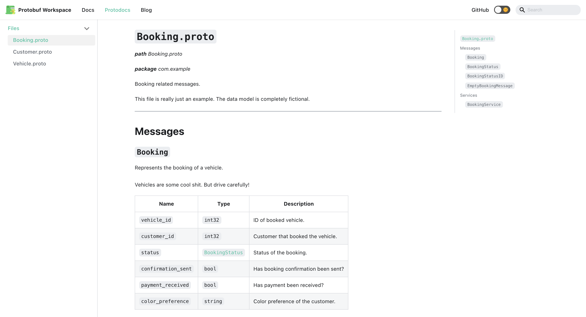
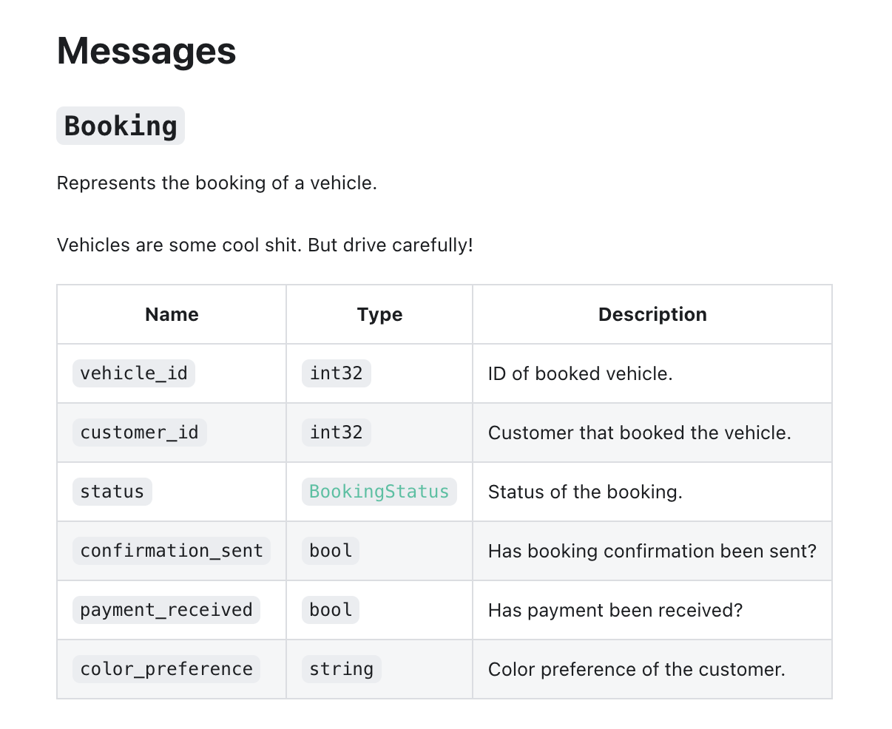
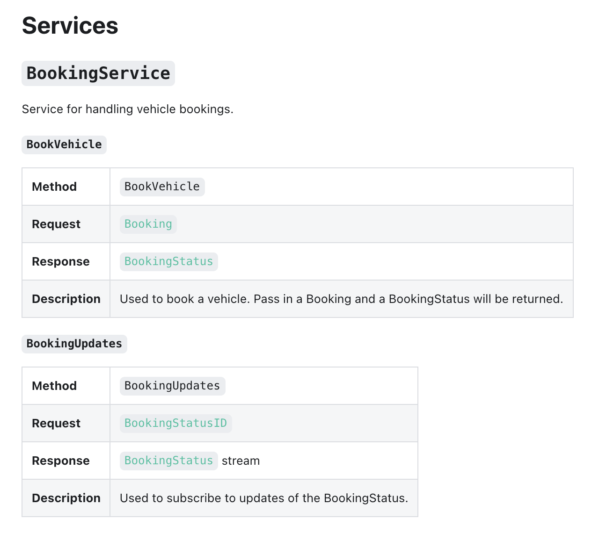

# Docusaurus Protobuf Project

[Docusaurus](https://docusaurus.io/) toolset for Protobuf contract documentation. Provides a set of components and MDX doc file generators for Docusaurus sites.

This is a [Lerna](https://lerna.js.org/) project containing all packages.

## Usage

See [`docusaurus-protobuffet`](https://github.com/AnthonyBobsin/docusaurus-protobuffet/tree/master/packages/docusaurus-protobuffet#usage) for details on usage.

See [`docusaurus-protobuffet-init`](https://github.com/AnthonyBobsin/docusaurus-protobuffet/tree/master/packages/docusaurus-protobuffet-init#usage) to create a new Docusaurus project with this toolset installed.

## Demo

Demo site coming soon!

## Packages

### [`docusaurus-protobuffet`](https://github.com/AnthonyBobsin/docusaurus-protobuffet/tree/master/packages/docusaurus-protobuffet)

Docusaurus preset to help mount the plugin and render all generated files.

### [`docusaurus-protobuffet-plugin`](https://github.com/AnthonyBobsin/docusaurus-protobuffet/tree/master/packages/docusaurus-protobuffet-plugin)

Docusaurus plugin containing the CLI commands, file generators, and components.

### [`docusaurus-protobuffet-init`](https://github.com/AnthonyBobsin/docusaurus-protobuffet/tree/master/packages/docusaurus-protobuffet-init)

Docusaurus project generator to scaffold a new site with these packages installed in a recommended setup.

## Contributing

Contributions, issues and feature requests are always welcome!
