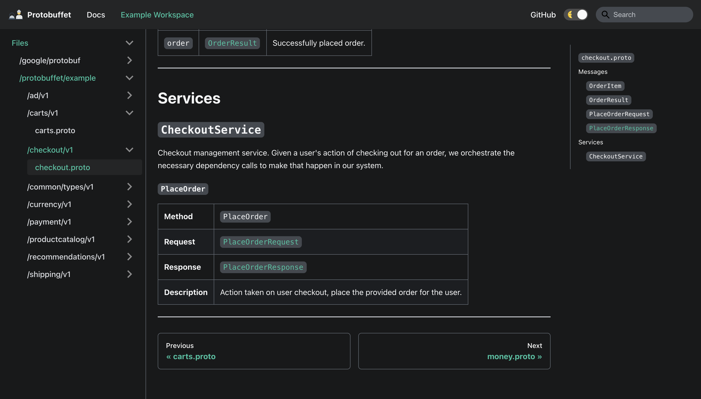

# Docusaurus Protobuf Project

#### Visit the [landing page](https://protobuffet.github.io/docusaurus-protobuffet/) for Protobuffet documentation.

[Docusaurus](https://docusaurus.io/) toolset for Protobuf contract documentation. Provides a set of components and MDX doc file generators for Docusaurus sites.

This is a [Lerna](https://lerna.js.org/) project containing all packages.

## Usage

See [`docusaurus-protobuffet`](https://github.com/protobuffet/docusaurus-protobuffet/tree/master/packages/docusaurus-protobuffet#usage) for details on usage.

See [`docusaurus-protobuffet-init`](https://github.com/protobuffet/docusaurus-protobuffet/tree/master/packages/docusaurus-protobuffet-init#usage) to create a new Docusaurus project with this toolset installed.

## Features
### Existing
- React components for documenting Protobuf file descriptors including messages, services, and enums.
- Markdown doc (mdx) generation for the [Docusaurus platform](https://docusaurus.io/).
- Docusaurus sidebar object generation for a complete documentation workspace.

### Planned
- Extension support for generated sidebar and mdx files.
- Service implementation and client documentation.

### Demo

Visit the [documentation site](https://protobuffet.github.io/docusaurus-protobuffet/docs/what/demo) for an interactive demo.

## Packages

### [`docusaurus-protobuffet`](https://github.com/protobuffet/docusaurus-protobuffet/tree/master/packages/docusaurus-protobuffet)

Docusaurus preset to help mount the plugin and render all generated files.

### [`docusaurus-protobuffet-init`](https://github.com/protobuffet/docusaurus-protobuffet/tree/master/packages/docusaurus-protobuffet-init)

Docusaurus project generator to scaffold a new site with these packages installed in a recommended setup.

### [`docusaurus-protobuffet-plugin`](https://github.com/protobuffet/docusaurus-protobuffet/tree/master/packages/docusaurus-protobuffet-plugin)

Docusaurus plugin containing the CLI commands, file generators, and components.

## Contributing

Contributions, issues and feature requests are always welcome!
